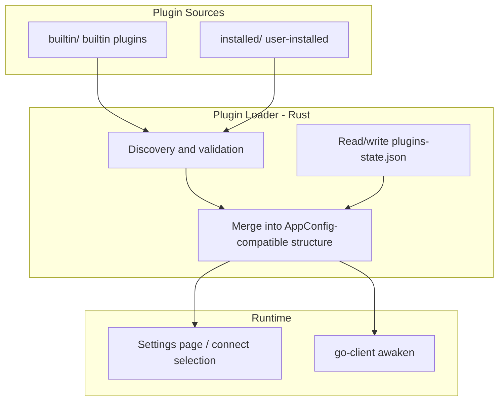
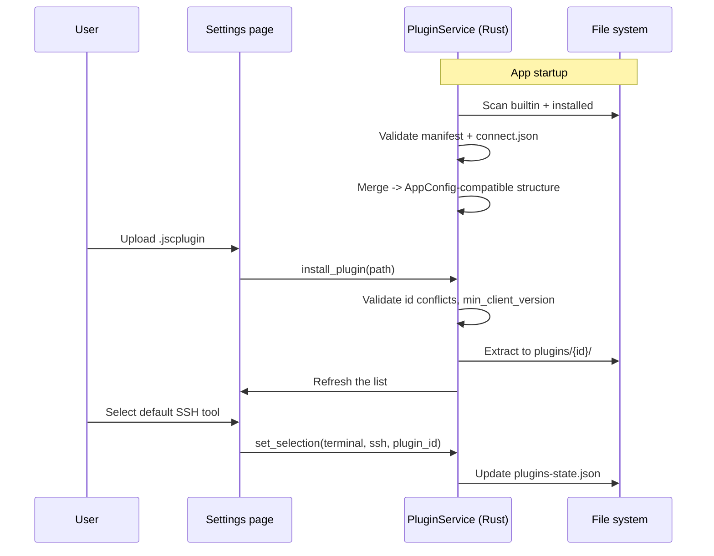

# JumpServer Client Connection Plugin Mechanism Design

## Background and Goals

The client currently defines external connection tools for each protocol (terminal, remote desktop, file transfer, database, etc.) through a single monolithic `config.json`. As the number of supported tools grows, this causes issues:

- The monolithic JSON is hard to maintain, with frequent merge conflicts
- Platform-specific logic is scattered across `awaken_*.go` and config (e.g. Navicat URL, iTerm AppleScript, AutoIt)
- Adding a new tool requires modifying the main repo and cutting a release; third parties can't extend it independently
- UI icons and tool names are hardcoded in Vue components

**Goal**: split each connection tool into an independent **plugin package**, bundling common plugins while allowing the rest to be uploaded and installed.

---

## Core Concepts

| Concept | Description |
|------|------|
| **Plugin** | A standalone directory or `.jscplugin` package describing one external connection tool |
| **Builtin plugin** | Shipped with the install package, located at `resources/plugins/builtin/` |
| **Installed plugin** | Installed by the user, located at `{config_dir}/jumpserver-client/plugins/` |
| **Manifest** | Plugin metadata: id, version, author, supported protocols, etc. |
| **Connect definition** | How to launch the external program on each platform |
| **User state** | User selections, custom paths, etc., kept separate from the plugin package |

---

## Architecture Overview



### Data flow

1. **On startup**: `PluginService` scans builtin + installed, validates the manifest, and merges into the existing `AppConfigType` structure (**backward compatible**).
2. **Settings page**: shows all available plugins; the user switches the default tool, configures the exe path → written to `plugins-state.json`.
3. **On connect**: `awaken` still reads the merged config, and executes the launch logic according to `launch.type`.

---

## Directory Layout

```
jumpserver-client/                 # User config directory
├── config.json                    # Gradually slimmed down: only keeps window/UI global settings
├── plugins-state.json             # User plugin preferences (replaces match_first / path / is_set)
└── plugins/
    └── {plugin_id}/               # User-installed plugins (extracted directory)

resources/                         # Inside the install package
└── plugins/
    └── builtin/
        ├── putty/
        ├── mstsc/
        └── ...
```

Repo development directory:

```
plugins/
├── schema/
│   └── manifest.schema.json
├── builtin/                       # Builtin plugin source (copied into resources at build time)
├── demo/                          # Third-party development example
└── tools/
    └── pack.sh                    # Packages a .jscplugin
```

---

## Plugin Package Structure

Each plugin is a directory, packaged as `{id}-{version}.jscplugin` (a ZIP, with a custom extension).

```
my-terminal-plugin/
├── manifest.json          # Required: metadata
├── icon.png               # Required: 128×128, shown on the settings page
├── connect.json           # Required: connect definition
├── README.md              # Optional: documentation
└── scripts/               # Optional: complex launch scripts
    ├── launch.windows.ps1
    ├── launch.macos.sh
    ├── launch.macos.applescript
    └── launch.linux.sh
```

### manifest.json

```json
{
  "id": "com.example.xshell",
  "name": "xshell",
  "display_name": "XShell",
  "version": "1.0.0",
  "min_client_version": "4.0.0",
  "author": "Example Corp",
  "homepage": "https://www.xshell.com",
  "download_url": "https://www.xshell.com/zh/xshell-download/",
  "category": "terminal",
  "protocols": ["ssh", "telnet"],
  "builtin": false,
  "comment": {
    "zh": "支持 SSH、TELNET 的终端模拟器。",
    "en": "Terminal emulator supporting SSH and TELNET."
  }
}
```

| Field | Required | Description |
|------|------|------|
| `id` | ✓ | Globally unique, reverse domain notation, used as the directory name after install |
| `name` | ✓ | Short name, used for icon fallback and logging |
| `display_name` | ✓ | Name shown in the UI |
| `version` | ✓ | Semantic version |
| `min_client_version` | ✓ | Minimum required client version |
| `category` | ✓ | `terminal` \| `remotedesktop` \| `filetransfer` \| `databases` |
| `protocols` | ✓ | List of supported protocols |
| `builtin` | | `true` means builtin, cannot be uninstalled |

### connect.json

Describes how to launch, per platform. `launch.type` determines the executor:

| type | Description | Typical scenario |
|------|------|----------|
| `args` | Template substitution used as command-line arguments | PuTTY, DBeaver |
| `script` | Runs the platform script under `scripts/`, passing in a JSON context | iTerm2, complex GUI automation |
| `url` | Builds a URL scheme and `open`s it | Navicat |
| `file` | Writes a temp file first, then opens it | RDP `.rdp` |
| `autoit` | Windows AutoIt step sequence (compatible with existing config) | Navicat form-filling |
| `system` | Calls a built-in OS capability | macOS `open` for an RDP file |

**Template variables** (consistent with the existing `arg_format`):

| Variable | Description |
|------|------|
| `{name}` | Connection session name (already escaped) |
| `{protocol}` | Protocol name |
| `{username}` | Account (SSH-type gets a `JMS-` prefix) |
| `{value}` | Password/token |
| `{host}` | Host address |
| `{port}` | Port |
| `{file}` | Temp file path (`file` type) |
| `{dbname}` | Database name |
| `{use_ssl}` | Whether SSL is used |
| `{allow_invalid_cert}` | Whether invalid certs are allowed |

See `plugins/demo/hello-terminal/connect.json` for an example.

### plugins-state.json (user state, not part of the plugin package)

```json
{
  "version": 1,
  "selections": {
    "terminal:ssh": "builtin.putty",
    "databases:mysql": "builtin.dbeaver"
  },
  "plugins": {
    "com.example.xshell": {
      "enabled": true,
      "path": "C:\\Program Files\\NetSarang\\Xshell 8\\Xshell.exe"
    }
  }
}
```

- `selections`: the currently selected plugin `id` for each `category:protocol` (replaces `match_first`)
- `plugins[id].path`: the user's custom executable path (replaces `path` in config)
- `plugins[id].enabled`: whether it's enabled (allows disabling an installed plugin)

---

## Plugin Lifecycle



### Install rules

1. Extract to `{config_dir}/plugins/{manifest.id}/`
2. If `id` conflicts with a builtin plugin → reject (builtin takes priority)
3. If the same `id` already exists → overwrite if the version is newer, reject if older
4. Optional: validate a `SIGNATURE` inside the ZIP (a future version)

### Uninstall rules

- Only `builtin: false` plugins can be uninstalled
- If the uninstalled plugin was the default for some protocol, fall back to the first available builtin plugin for that protocol

---

## Migration Strategy for Existing Code

### Phase 1: Plugin-ize the config (compatibility mode)

- Split each `AppItem` in `config.json` into `plugins/builtin/{name}/`
- Add a new `PluginService` (Rust) that merges into the existing `AppConfigType` at startup
- `get_config` / `update_config_selection` are changed to read/write `plugins-state.json`
- **No major changes needed on the frontend or go-client**

### Phase 2: Plugin-ize the launcher

- `awaken` gets a `launch.type` dispatch: `script` / `url` / `file`
- Special-case logic like Navicat and iTerm is moved into the corresponding plugin's `scripts/`
- Reduces hardcoding in `awaken_windows.go`

### Phase 3: Plugin marketplace (optional)

- The JumpServer server distributes `.jscplugin` packages
- Enterprise admins push plugin policies

### Slimming down config.json

Keep:

```json
{
  "filename": "Jumpserver Clients Config",
  "version": 9,
  "windowBounds": { "width": 1280, "height": 800 },
  "defaultSetting": { "theme": "light", "layout": "list", "language": "en" }
}
```

Remove the app lists under `windows` / `macos` / `linux` (moved to plugins).

---

## API Design (Tauri Commands)

| Command | Description |
|---------|------|
| `list_plugins` | List all plugins (builtin + installed) and their state |
| `get_config` | Return the merged `AppConfigType` (compatible with the existing frontend) |
| `install_plugin` | Install a `.jscplugin` package |
| `uninstall_plugin` | Uninstall a user plugin |
| `update_config_selection` | Set the default plugin for a protocol / a custom path (compatible with the existing signature) |
| `export_plugin_template` | Export a blank template ZIP (developer tool) |

---

## Security Considerations

1. **Script execution**: the `script` type only executes scripts under the plugin's own `scripts/` directory; `..` paths are forbidden
2. **Install source**: the first version only supports local file selection; signature verification may be added later
3. **Permission declaration**: the manifest may add a `permissions: ["exec", "write_temp_file"]` field for review purposes
4. **Sandboxing**: scripts receive parameters via the `JMS_CONNECT_JSON` environment variable, not by concatenating shell strings

---

## Plugin Package Format (.jscplugin)

- ZIP compression, UTF-8 filenames
- `manifest.json` sits directly at the root (no extra top-level folder)
- Recommended naming: `{id}@{version}.jscplugin`, e.g. `com.example.xshell@1.0.0.jscplugin`

Packaging:

```bash
./plugins/tools/pack.sh plugins/demo/hello-terminal
```

---

## Suggested Builtin Plugin List

| Platform | category | Suggested builtin |
|------|----------|----------|
| Windows | terminal | putty |
| Windows | remotedesktop | mstsc |
| Windows | filetransfer | winscp (optional) |
| macOS | terminal | terminal, iterm |
| macOS | remotedesktop | system RDP (open) |
| Linux | terminal | system terminal |
| Linux | remotedesktop | xfreerdp, tigervnc |
| All platforms | databases | dbeaver (requires the user to configure the path) |

The rest (XShell, Navicat, MobaXterm, etc.) are provided as **optional plugins**, available for download or for users to package and install themselves.
